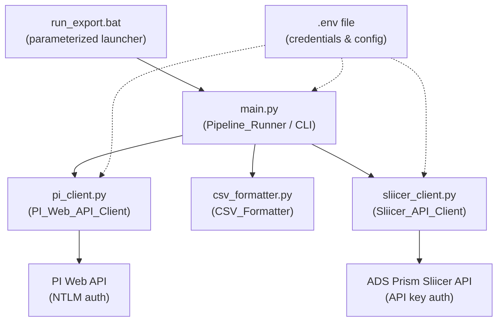
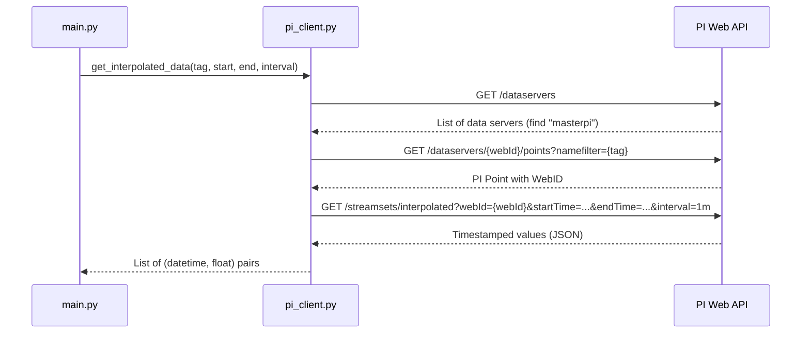

# Design Document: PI to Sliicer Automation

## Overview

This design describes a Python 3.12 pipeline that replaces the existing R-based workflow for pulling flow data from AVEVA PI Web API, computing hourly averages, writing Sliicer-compatible CSV files, and optionally posting telemetry to the ADS Prism Sliicer API.

The solution lives entirely in `data-to-sliicer/` and consists of three Python modules plus an orchestration script and a `.bat` launcher. It uses `requests` + `requests-ntlm` for NTLM authentication, `python-dotenv` for configuration, and Python's standard library for everything else (csv, logging, argparse, datetime).

The pipeline is built in three incremental phases:
- Phase 1: PI Web API data retrieval (standalone, can dump raw data)
- Phase 2: CSV formatting and file output
- Phase 3: Sliicer API posting

Each phase is additive — Phase 1 works alone, Phase 2 adds CSV output on top of Phase 1, Phase 3 adds API posting on top of Phase 2.

## Architecture



### Request Flow (Phase 1 — PI Data Retrieval)



### File Layout

```
ini-analysis/
├── .env                          # existing — credentials (unchanged)
├── data-to-sliicer/
│   ├── pi_client.py              # PI Web API client module
│   ├── csv_formatter.py          # Sliicer CSV writer/reader
│   ├── sliicer_client.py         # Sliicer API client (Phase 3)
│   ├── main.py                   # CLI orchestration script
│   ├── run_export.bat            # Windows batch launcher
│   └── examples/                 # existing example CSVs
│       ├── WES8617.csv
│       └── BRA10477.csv
```

Four Python files + one batch file. No packages, no `__init__.py`, no nested folders. The `.env` stays in the parent `ini-analysis/` directory where it already lives.

## Components and Interfaces

### 1. `pi_client.py` — PI Web API Client

Handles all communication with PI Web API. Stateless functions that accept a `requests.Session` (pre-configured with NTLM auth).

```python
def create_session(url: str, user: str, password: str, verify_tls: bool) -> requests.Session:
    """Create a requests Session with NTLM auth pre-configured."""

def find_data_server(session: requests.Session, base_url: str, server_name: str) -> str:
    """Query /dataservers, find server by name (case-insensitive), return its WebID.
    Raises ValueError if not found."""

def find_point_webid(session: requests.Session, base_url: str, server_webid: str, tag_name: str) -> str:
    """Query /dataservers/{webid}/points?namefilter={tag}, return the point's WebID.
    Raises ValueError if not found."""

def get_interpolated_data(
    session: requests.Session,
    base_url: str,
    web_id: str,
    start_time: str,
    end_time: str,
    interval: str = "1m"
) -> list[tuple[datetime, float]]:
    """Query /streamsets/interpolated, parse response, filter non-numeric values,
    convert timestamps to local timezone. Returns list of (datetime, value) pairs."""
```

All functions raise descriptive errors on HTTP failures (status code + body included).

### 2. `csv_formatter.py` — Sliicer CSV Formatter

Pure functions for writing and parsing the Sliicer CSV format. No I/O dependencies beyond file handles.

```python
def derive_site_id(tag_name: str) -> str:
    """Extract Site_ID from PI tag name.
    e.g., 'wwl:south:wes8617b_realtmmetflo' -> 'WES8617'"""

def compute_hourly_averages(
    data: list[tuple[datetime, float]]
) -> list[tuple[datetime, float | None]]:
    """Group 1-minute data by clock hour, compute mean per group.
    Returns (hour_timestamp, avg_value) pairs. None for hours with no valid data."""

def format_timestamp(dt: datetime) -> str:
    """Format datetime as 'MM/dd/yyyy h:mm:ss tt' (12-hour AM/PM)."""

def format_value(value: float | None) -> str:
    """Format a numeric value or return '#VALUE!' for None."""

def write_sliicer_csv(
    file_path: str,
    site_id: str,
    rows: list[tuple[datetime, float | None]]
) -> int:
    """Write the 3-line header + data rows. Returns number of data rows written.
    Uses Windows line endings (\\r\\n)."""

def parse_sliicer_csv(
    file_path: str
) -> list[tuple[datetime, float | None]]:
    """Parse a Sliicer CSV back into (datetime, value|None) pairs.
    Used for round-trip verification."""
```

### 3. `sliicer_client.py` — Sliicer API Client (Phase 3)

```python
def post_telemetry(
    api_key: str,
    site_id: str,
    rows: list[tuple[datetime, float | None]],
    base_url: str = "https://api.adsprism.com"
) -> dict:
    """POST formatted telemetry data to /api/Telemetry.
    Raises on HTTP errors with status code and body."""
```

### 4. `main.py` — Pipeline Runner / CLI

Orchestrates the pipeline using `argparse` for CLI parameters and Python's `logging` module.

```python
# CLI arguments:
#   tag         — PI Point tag name (positional, required)
#   start       — start time (positional, required)
#   end         — end time (positional, required)
#   --calc-type — "average" (default) or "interpolated"
#   --output    — output CSV path (default: {site_id}.csv)
#   --post-to-sliicer — flag to enable Phase 3 API posting
#   --log-level — logging level (default: INFO)
```

### 5. `run_export.bat` — Windows Batch Launcher

```bat
@echo off
REM Usage: run_export.bat <tag> <start> <end> [calc_type]
set TAG=%1
set START=%2
set END=%3
set CALC_TYPE=%4
if "%CALC_TYPE%"=="" set CALC_TYPE=average

python main.py "%TAG%" "%START%" "%END%" --calc-type %CALC_TYPE%
```

## Data Models

### PI Web API Response Structures

**GET /dataservers response** (Items array):
```json
{
  "Items": [
    {
      "WebId": "F1DSxxxxxxxxxx",
      "Name": "masterpi",
      "ServerVersion": "..."
    }
  ]
}
```

**GET /dataservers/{webId}/points?namefilter={tag} response** (Items array):
```json
{
  "Items": [
    {
      "WebId": "F1DPxxxxxxxxxx",
      "Name": "wwl:south:wes8617b_realtmmetflo",
      "PointType": "Float32"
    }
  ]
}
```

**GET /streamsets/interpolated response**:
```json
{
  "Items": [
    {
      "Name": "wwl:south:wes8617b_realtmmetflo",
      "Items": [
        {
          "Timestamp": "2024-06-12T00:00:00Z",
          "Value": 2.184343173,
          "Good": true
        },
        {
          "Timestamp": "2024-06-12T00:01:00Z",
          "Value": {"Name": "Shutdown", "Value": 0},
          "Good": false
        }
      ]
    }
  ]
}
```

Non-numeric values (like the digital state object in the second item above) are filtered out during parsing.

### Internal Data Structures

All internal data flows as plain Python types — no custom classes needed:

| Structure | Type | Description |
|---|---|---|
| Raw interpolated data | `list[tuple[datetime, float]]` | 1-minute timestamp-value pairs from PI |
| Hourly averages | `list[tuple[datetime, float \| None]]` | Hourly means; `None` = all-bad hour |
| Site ID | `str` | Derived from tag name, e.g. `"WES8617"` |

### Sliicer CSV Format

```
{Site_ID},Average=None,QualityFlag=FALSE,QualityValue=FALSE\r\n
DateTime,MP1\QFINAL,MP1\QCONTINUITY,MP1\QUANTITY\r\n
MM/dd/yyyy h:mm:ss tt,MGD,MGD,MGD\r\n
06/12/2024 12:00:00 AM,2.184343173,2.184343173,2.184343173\r\n
06/12/2024 01:00:00 AM,1.872502524,1.872502524,1.872502524\r\n
...
```

### Environment Variables (`.env`)

| Variable | Required | Description |
|---|---|---|
| `PIWEBAPI_URL` | Yes | Base URL for PI Web API |
| `PIWEBAPI_USER` | Yes | NTLM username (DOMAIN\user) |
| `PIWEBAPI_PASS` | Yes | NTLM password |
| `PIWEBAPI_VERIFY_TLS` | Yes | `true` or `false` |
| `PIWEBAPI_SERVER` | No | Data server name (default: `masterpi`) |
| `SLIICER_API_KEY` | Phase 3 | ADS Prism Sliicer API key |


## Correctness Properties

*A property is a characteristic or behavior that should hold true across all valid executions of a system — essentially, a formal statement about what the system should do. Properties serve as the bridge between human-readable specifications and machine-verifiable correctness guarantees.*

### Property 1: CSV Round-Trip

*For any* valid list of hourly (datetime, float|None) pairs, writing them to a Sliicer CSV file via `write_sliicer_csv` and then parsing that file back via `parse_sliicer_csv` should produce an equivalent list of (datetime, float|None) pairs — timestamps match to the minute and numeric values match to at least 9 significant digits.

**Validates: Requirements 6.1, 6.2**

### Property 2: Hourly Grouping Structure

*For any* list of 1-minute timestamped data points spanning N distinct clock hours, `compute_hourly_averages` should produce exactly N output entries, one per clock hour, and every input data point's hour (floored) should correspond to exactly one output entry.

**Validates: Requirements 4.1, 4.3**

### Property 3: Hourly Average Value

*For any* list of 1-minute timestamped numeric values that all fall within the same clock hour, `compute_hourly_averages` should return a single entry whose value equals the arithmetic mean of those input values.

**Validates: Requirements 4.2**

### Property 4: Non-Numeric Value Filtering

*For any* PI Web API response containing a mix of numeric and non-numeric Value fields, the parsed output should contain exactly the items whose Value is numeric, with correct (datetime, float) typing, and no non-numeric items.

**Validates: Requirements 3.3, 3.4**

### Property 5: Timestamp Timezone Conversion

*For any* ISO 8601 UTC timestamp returned by PI Web API, the converted local datetime should represent the same instant in time (i.e., converting back to UTC yields the original timestamp).

**Validates: Requirements 3.5**

### Property 6: Data Row Format

*For any* (datetime, float) pair, the formatted CSV data row should contain the timestamp in `MM/dd/yyyy h:mm:ss tt` 12-hour AM/PM format, followed by the same numeric value repeated in exactly three comma-separated columns.

**Validates: Requirements 5.4**

### Property 7: Numeric Formatting Fidelity

*For any* float value with up to 9 significant digits, `format_value` should produce a string with no trailing zeros after the decimal point, and parsing that string back to float should recover the original value to at least 9 significant digits of precision.

**Validates: Requirements 5.5, 6.2**

### Property 8: Site ID Derivation

*For any* PI Point tag name following the convention `{prefix}:{location}:{siteid}{suffix}_realtmmetflo`, `derive_site_id` should return the uppercase site ID portion (e.g., `"wwl:south:wes8617b_realtmmetflo"` → `"WES8617"`).

**Validates: Requirements 7.3**

### Property 9: Missing Environment Variable Error

*For any* non-empty subset of the required environment variables (`PIWEBAPI_URL`, `PIWEBAPI_USER`, `PIWEBAPI_PASS`, `PIWEBAPI_VERIFY_TLS`) that is absent, the configuration loader should raise an error whose message names at least one of the missing variables.

**Validates: Requirements 1.4**

### Property 10: HTTP Error Propagation

*For any* HTTP response with a 4xx or 5xx status code, the PI Web API client (and Sliicer API client) should raise an error whose message contains both the numeric status code and the response body text.

**Validates: Requirements 1.5, 8.3**

### Property 11: Data Server Not Found Error

*For any* list of data server names that does not contain the target server name (case-insensitive), `find_data_server` should raise a ValueError.

**Validates: Requirements 2.3**

## Error Handling

### Configuration Errors
- Missing `.env` file or missing required variables → `ValueError` with descriptive message naming the missing variable(s)
- Invalid `PIWEBAPI_VERIFY_TLS` value → treat as `True` (safe default), log a warning

### PI Web API Errors
- HTTP 401/403 → raise with "Authentication failed" + status code + body (likely NTLM credential issue)
- HTTP 404 on `/dataservers` → raise with "PI Web API base URL may be incorrect"
- Data server not found in list → `ValueError("Data server '{name}' not found")`
- PI Point not found → `ValueError("PI Point '{tag}' not found on server '{server}'")`
- HTTP 5xx → raise with status code + body, suggest checking PI Web API server health
- Connection timeout / network error → let `requests` exceptions propagate with context

### Data Processing Errors
- All values in an hourly group are non-numeric → output `None` for that hour (formats as `#VALUE!`)
- Empty response from PI Web API (no items) → log warning, produce empty CSV with header only
- Timestamp parsing failure → skip the item, log warning

### Sliicer API Errors (Phase 3)
- Missing `SLIICER_API_KEY` when `--post-to-sliicer` is used → `ValueError` with descriptive message
- HTTP errors from Sliicer API → raise with status code + body

### General Strategy
- All errors are raised as Python exceptions (ValueError, requests.HTTPError)
- `main.py` catches all exceptions at the top level, logs them via `logging.error()`, and exits with non-zero status
- No silent failures — every error is either raised or logged

## Testing Strategy

### Property-Based Testing

Use `hypothesis` as the property-based testing library (the standard for Python PBT).

Each correctness property from the design maps to exactly one `hypothesis` test. Tests are configured with `@settings(max_examples=100)` minimum.

Each test is tagged with a comment referencing its design property:
```python
# Feature: pi-to-sliicer-automation, Property 1: CSV Round-Trip
@given(st.lists(st.tuples(hourly_datetimes(), st.one_of(st.floats(...), st.none()))))
def test_csv_round_trip(data):
    ...
```

Property tests focus on:
- `csv_formatter.py` functions (Properties 1, 2, 3, 6, 7, 8)
- `pi_client.py` parsing/filtering logic (Properties 4, 5)
- Configuration validation (Properties 9, 10, 11)

### Unit Testing

Use `pytest` for unit tests. Unit tests complement property tests by covering:

- Specific examples from the existing CSV files (WES8617.csv, BRA10477.csv)
- Header format verification (lines 1-3 match exactly)
- Edge cases: empty data, single row, midnight boundary, `#VALUE!` rows
- Integration points: mock PI Web API responses to verify the full call chain
- CLI argument parsing: verify argparse configuration
- `.bat` file existence and basic structure

### Test File Layout

```
data-to-sliicer/
├── tests/
│   ├── test_csv_formatter.py      # Unit + property tests for CSV formatting
│   ├── test_pi_client.py          # Unit + property tests for PI client parsing
│   ├── test_hourly_avg.py         # Unit + property tests for hourly averaging
│   └── test_main.py               # Unit tests for CLI and orchestration
```

### Key Testing Decisions

- Property tests use `hypothesis` with `min_examples=100` per property
- Unit tests use `pytest` with standard assertions
- PI Web API calls are mocked in tests (no live API calls in CI)
- CSV round-trip tests use `tempfile` for file I/O
- Timestamp generators produce aware datetimes in a reasonable range (2020-2030)
- Float generators use `allow_nan=False, allow_infinity=False` with reasonable magnitude bounds
